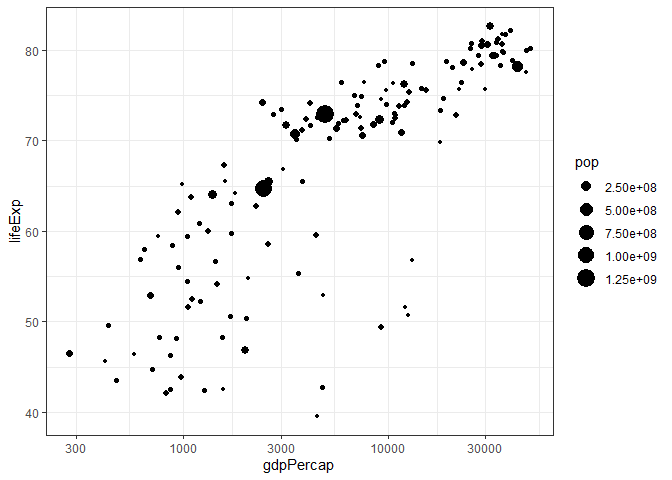
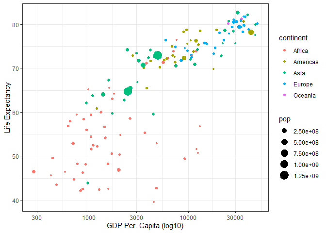
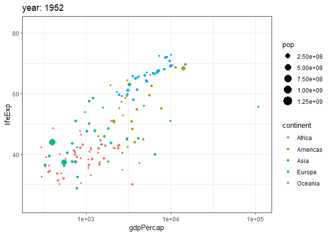

CDS - W5 - Assignment skrt
================

# Explore the recent global developments with R

Today, you will load a filtered gapminder dataset - with a subset of
data on global development from 1952 - 2007 in increments of 5 years -
to capture the period between the Second World War and the Global
Financial Crisis.

**Your task: Explore the data and visualise it in both static and
animated ways, providing answers and solutions to 7 questions/tasks
below.**

## Get the necessary packages

First, start with installing the relevant packages ‘tidyverse’,
‘gganimate’, and ‘gapminder’.

## Look at the data

First, see which specific years are actually represented in the dataset
and what variables are being recorded for each country. Note that when
you run the cell below, Rmarkdown will give you two results - one for
each line - that you can flip between.

``` r
unique(gapminder$year)
```

    ##  [1] 1952 1957 1962 1967 1972 1977 1982 1987 1992 1997 2002 2007

``` r
head(gapminder)
```

    ## # A tibble: 6 x 6
    ##   country     continent  year lifeExp      pop gdpPercap
    ##   <fct>       <fct>     <int>   <dbl>    <int>     <dbl>
    ## 1 Afghanistan Asia       1952    28.8  8425333      779.
    ## 2 Afghanistan Asia       1957    30.3  9240934      821.
    ## 3 Afghanistan Asia       1962    32.0 10267083      853.
    ## 4 Afghanistan Asia       1967    34.0 11537966      836.
    ## 5 Afghanistan Asia       1972    36.1 13079460      740.
    ## 6 Afghanistan Asia       1977    38.4 14880372      786.

The dataset contains information on each country in the sampled year,
its continent, life expectancy, population, and GDP per capita.

Let’s plot all the countries in
1952.

``` r
theme_set(theme_bw())  # set theme to white background for better visibility

ggplot(subset(gapminder, year == 1952), aes(gdpPercap, lifeExp, size = pop)) +
  geom_point() +
  scale_x_log10() 
```

<!-- --> We see an
interesting spread with an outlier to the right. Answer the following
questions, please:

Q1. Why does it make sense to have a log10 scale on x axis? A1. Because
it avoids a skew towards the large data points, which becomes a problem
when a few data points are much larger than the rest of the data (as is
the case here).

Q2. What country is the richest in 1952 (far right on x axis)? A2. This
can not be deducted from the plot, so I solve the question using the
following code.

``` r
gapminder[gapminder$gdpPercap==max(gapminder$gdpPercap),]
```

    ## # A tibble: 1 x 6
    ##   country continent  year lifeExp    pop gdpPercap
    ##   <fct>   <fct>     <int>   <dbl>  <int>     <dbl>
    ## 1 Kuwait  Asia       1957    58.0 212846   113523.

A2 cont. As we can see here, the richest country (as measured by gdp
per. capita) is Kuwait.

You can generate a similar plot for 2007 and compare the
differences

``` r
ggplot(subset(gapminder, year == 2007), aes(gdpPercap, lifeExp, size = pop, colour = continent)) +
  geom_point() +
  scale_x_log10() 
```

<!-- --> The black
bubbles are a bit hard to read, the comparison would be easier with a
bit more visual differentiation.

Q3. Can you differentiate the continents by color and fix the axis
labels?

``` r
ggplot(subset(gapminder, year == 2007), aes(gdpPercap, lifeExp, size = pop, colour = continent)) +
  geom_point() +
  scale_x_log10() + xlab("gdpPercap (log10)") + ylab("Life Expectancy")
```

<!-- -->

Q4. What are the five richest countries in the world in
2007?

``` r
gapminder %>% filter(year==2007) %>% group_by(country) %>% summarise(gdpPercap) %>%  arrange(desc(gdpPercap), desc(country))
```

    ## `summarise()` ungrouping output (override with `.groups` argument)

    ## # A tibble: 142 x 2
    ##    country          gdpPercap
    ##    <fct>                <dbl>
    ##  1 Norway              49357.
    ##  2 Kuwait              47307.
    ##  3 Singapore           47143.
    ##  4 United States       42952.
    ##  5 Ireland             40676.
    ##  6 Hong Kong, China    39725.
    ##  7 Switzerland         37506.
    ##  8 Netherlands         36798.
    ##  9 Canada              36319.
    ## 10 Iceland             36181.
    ## # ... with 132 more rows

## Make it move\!

The comparison would be easier if we had the two graphs together,
animated. We have a lovely tool in R to do this: the `gganimate`
package. And there are two ways of animating the gapminder ggplot.

### Option 1: Animate using transition\_states()

The first step is to create the object-to-be-animated

``` r
anim <- ggplot(gapminder, aes(gdpPercap, lifeExp, size = pop)) +
  geom_point() +
  scale_x_log10()  # convert x to log scale
anim
```

<!-- -->

This plot collates all the points across time. The next step is to split
it into years and animate it. This may take some time, depending on the
processing power of your computer (and other things you are asking it to
do). Beware that the animation might appear in the ‘Viewer’ pane, not in
this rmd preview. You need to knit the document to get the viz inside an
html file.

``` r
anim + transition_states(year, 
                      transition_length = 1,
                      state_length = 1)
```

<!-- -->

``` r
#I needed the package gifski to make it work
p_load(gifski)
```

Notice how the animation moves jerkily, ‘jumping’ from one year to the
next 12 times in total. This is a bit clunky, which is why it’s good we
have another option.

### Option 2 Animate using transition\_time()

This option smoothes the transition between different ‘frames’, because
it interpolates and adds transitional years where there are gaps in the
timeseries data.

``` r
anim2 <- ggplot(gapminder, aes(gdpPercap, lifeExp, size = pop)) +
  geom_point() +
  scale_x_log10() + # convert x to log scale
  transition_time(year) 
anim2
```

<!-- -->

The much smoother movement in Option 2 will be much more noticeable if
you add a title to the chart, that will page through the years
corresponding to each frame.

Q5 Can you add a title to one or both of the animations above that will
change in sync with the animation? \[hint: search labeling for
transition\_states() and transition\_time() functions respectively\]

A5. When using the transition\_time function, a variable (available for
string literal interpretation) named frame\_time, will be made. This can
be used in cunjunction with the ‘label’ geom of ggplot to display the
year of each animation frame. The same can be done with the other plot
by writing “{closest\_state}”. To make it even cooler, I have added each
continent as a unique
color.

``` r
anim3 <- ggplot(gapminder, aes(gdpPercap, lifeExp, size = pop,colour=continent)) +
  geom_point() +
  scale_x_log10() + # convert x to log scale
  transition_states(year) +
  labs(title = 'year: {closest_state}')
anim3
```

<!-- -->

``` r
anim4 <- ggplot(gapminder, aes(gdpPercap, lifeExp, size = pop, colour=continent)) +
  geom_point() +
  scale_x_log10() + # convert x to log scale
  transition_time(year) +
  labs(title = 'year: {frame_time}')
anim4
```

<!-- -->

Q6 Can you made the axes’ labels and units more readable? Consider
expanding the abreviated lables as well as the scientific notation in
the legend and x axis to whole numbers.\[hint:search disabling
scientific notation\]

A6. I change the x-axis label to make it easier to read and I change the
labels on the axes. I also use the options function to remove scientific
notation in the legend.

``` r
options(scipen=10000)


anim5 <- ggplot(gapminder, aes(gdpPercap, lifeExp, size = pop, colour=continent)) +
  geom_point() +
  scale_x_log10(labels=trans_format('log10',math_format(10^.x))) + # convert x to log scale
  transition_time(year) +
  labs(title = 'year: {frame_time}')+xlab("GDP Per. Capita")+ylab("Life Expectancy")
anim5
```

<!-- -->

Q7 Come up with a question you want to answer using the gapminder data
and write it down. Then, create a data visualisation that answers the
question and explain how your visualization answers the question.
(Example: you wish to see what was mean life expectancy across the
continents in the year you were born versus your parents’ birth years).
\[hint: if you wish to have more data than is in the filtered gapminder,
you can load either the `gapminder_unfiltered` dataset and download more
at <https://www.gapminder.org/data/> \]

A7. How has life expectancy changed as a function of years after 1952.

``` r
birth <- ggplot(gapminder, aes(year, lifeExp)) +
  geom_smooth()+ xlab("year")+ylab("Life Expectancy")
birth
```

    ## `geom_smooth()` using method = 'gam' and formula 'y ~ s(x, bs = "cs")'

<!-- -->
